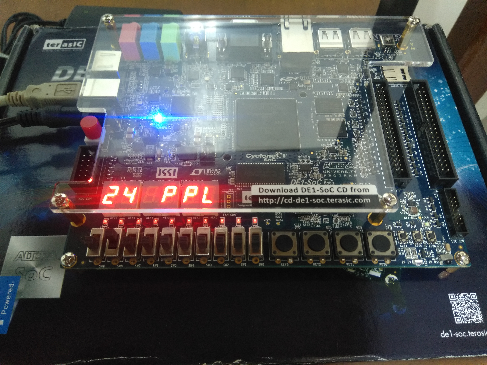
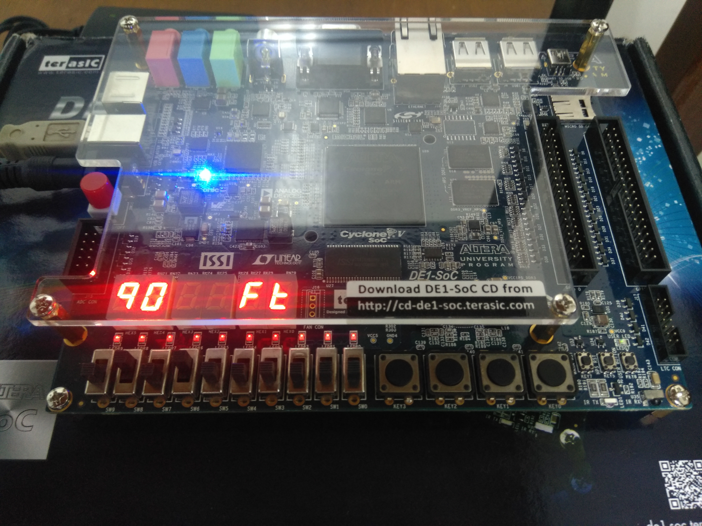
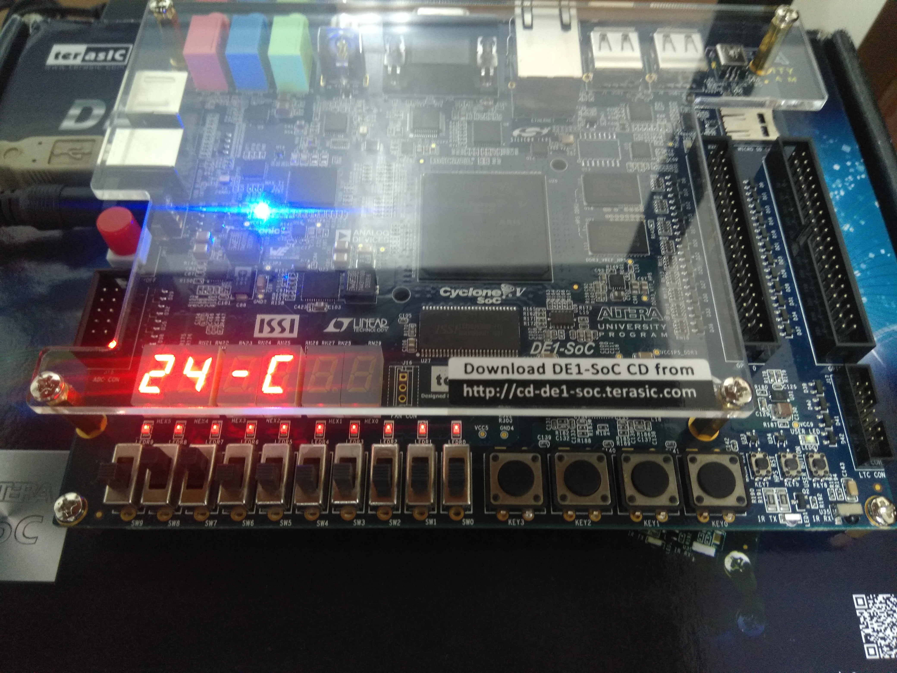
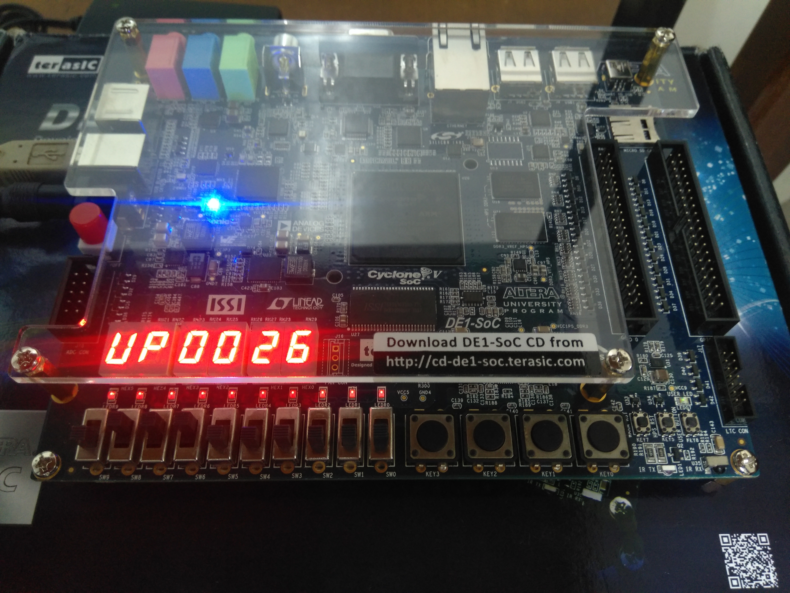

# Development of Cost-Efficient Air Conditioning Controllers using FPGA
Our final project

- Module 0011:	Current State

  
  
- Module 0100:	Number of people

 To add people, Module should be in **0100 0000** then press Key3.
 
 To remove people, Module should be in **0100 0001** then press Key3.
 
 

- Module 0101:	Room Size

 To add area, Module should be in **0101 0000** then press Key3.
 
 To remove area, Module should be in **0101 0001** then press Key3.
 
 

- Module 0110:	Temperature

 | Persons        | Temperature   |
 | -------------  |:-------------:|
 | 0        | OFF          |
 | 1  :   14        | 26°C          |
 | 15 : 24        | 24°C          |
 | 25 : 34        | 22°C          |
 | 35 : 44        | 20°C          |

- Module 0111:	Uptime

## To do:

- Module 0000:	Time
- Module 0001:	Date
- Module 0010:	Day
